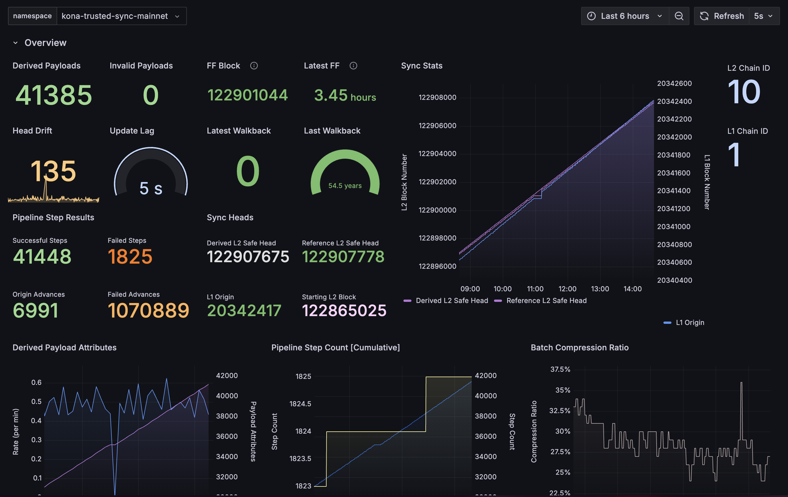

# Week 0

*Publish Date: September 27, 2024*

*[Newsletters Source][newsletters-source]*

### Overview

This Newsletter is ported over from the Kona project, and is the first
newsletter for the *Alt Stack Team*, a team dedicated to the Rust OP Stack
at [OP Labs][op-labs].


### Updates

The implementation of the Holocene hardfork is in full-swing, and [@refcell] is well into Holocene in [`kona-derive`][kona-derive]! For a working document of the fork implementation progress, see https://github.com/anton-rs/kona/issues/556.

Kona also received a docs refresh courtesy of [@clabby] over at [anton-rs.github.io/kona][kona-book]. We’d love some feedback, specifically on the SDK section!


### Blockers

We are blocked on completing the execution layer changes within [`kona`][kona] with the [`revm`][revm] changes pending. Currently Cody Wang from Coinbase is owning these, and we’ve reached out to see how we can help to keep progress moving.

We are also blocked on implementing action tests upstream in [`op-e2e`][op-e2e] until the upstream implementation has been completed. However, ours is not complete either, so this will manifest in a week or two.


### Projects

#### Kona Project

*✅ = DONE | 🚧 = WIP | 🛑 = NOT STARTED*

🕜 Total Length of the Project ~= 23 weeks

Project Start Date: June 10, 2024

Project End Date: November 18, 2024

##### **Phase 1: Asterisc** ✅

```json
{
  "ProxyAdmin": "0x59cff637c814B045F154Be583a24179d3AF9F167",
  "DisputeGameFactoryProxy": "0x69Fe8a33BaEC98698a4170E898B59aE3E0C651aD",
  "AnchorStateRegistryProxy": "0xe2be2262b8F462B3D478Ff9bF7a51B8645772F49",
  "DisputeGameFactory": "0x0d960BcFf756449Ef40a03254f5bAC4DB3896ac4",
  "RISCV": "0xFde3de8B91B9cb7D5b92645ceA74B8B5a32092B5",
  "AnchorStateRegistry": "0xc45320A1e9CDB1B52E332c1389BE330ab7ec17A5",
  "FaultDisputeGame": "0x3f6F314093ff095494eB2C8268D810d50D212508"
  "PreimageOracle": "0x627F825CBd48c4102d36f287be71f4234426b9e4",
  "DelayedWETHProxy": "0xF3D833949133e4E4D3551343494b34079598EA5a",
}
```

##### **Phase 2: Kona Derive** ✅

<table>
<tr>
<th> <b>OP Mainnet Trusted Sync Grafana</b> </th>
<th> <b>OP Sepolia Trusted Sync Grafana</b> </th>
</tr>
<tr>
<td>



</td>
<td>


</td>
</tr>
</table>

**Trusted Sync Alerts**


##### **Phase 3: Client + Host ✅**

##### **Phase 4: Test Suite ✅**

##### **Phase 5: Holocene - 🚧 WIP**


<!-- Links -->

{{#include ./links.md}}
