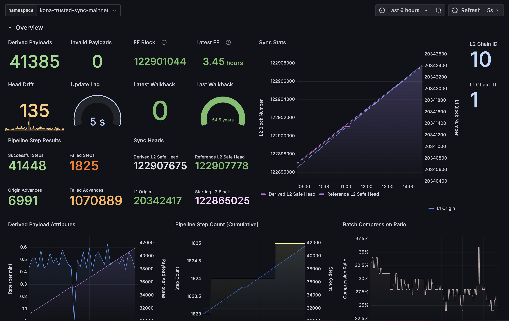
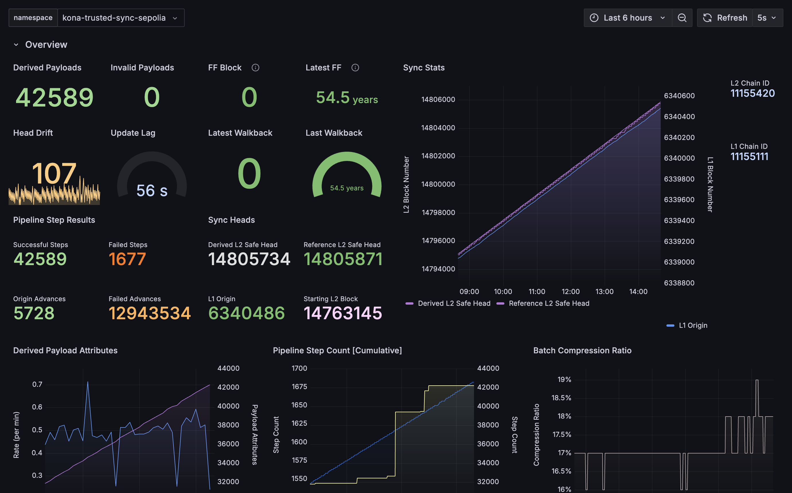
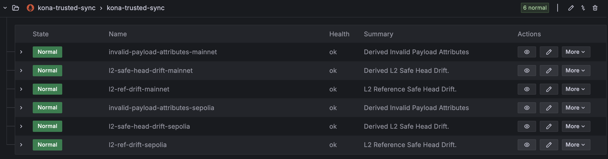

# Week 1

*Publish Date: October 4, 2024*

*[Newsletters Source][newsletters-source]*


## Overview

This is the first newsletter for the **Alt Stack Team** - a new team
at [OP Labs][op-labs] dedicated to building and maintaing alternative
implementations of the OP Stack.

Alt Stack Team projects include:
- `op-reth`
- `kona`
- `op-alloy`
- `op-rs`
- `superchain`

If you're interested in joining the **Alt Stack Team**, reach out to:
- [@clabby]
- [@refcell]

or just ship a bunch of prs into the above projects, and we might just
reach out to you!


## Updates

Holocene Hardfork changes are code-complete in [kona] 🎉.

To unblock ourselves on implementing action tests without the `op-node`'s
derivation pipeline being feature complete with Holocene by configuring
[`op-e2e`][op-e2e] to skip Holocene action tests if the environment variable
is set to run `op-program`, allowing action tests to run if `kona` is set.
This allows us to ship Holocene action tests that run against [kona], allowing
the `op-node` folks to activate when feature complete.


## Projects


{{#include ./op-reth.md}}

`op-reth` is being updated for Holocene.
This work is expected to wrap up within the next week.


{{#include ./kona.md}}

<details>
    <summary><b>Phase 1: Asterisc ✅</b></summary>

    ```json
    {
      "ProxyAdmin": "0x59cff637c814B045F154Be583a24179d3AF9F167",
      "DisputeGameFactoryProxy": "0x69Fe8a33BaEC98698a4170E898B59aE3E0C651aD",
      "AnchorStateRegistryProxy": "0xe2be2262b8F462B3D478Ff9bF7a51B8645772F49",
      "DisputeGameFactory": "0x0d960BcFf756449Ef40a03254f5bAC4DB3896ac4",
      "RISCV": "0xFde3de8B91B9cb7D5b92645ceA74B8B5a32092B5",
      "AnchorStateRegistry": "0xc45320A1e9CDB1B52E332c1389BE330ab7ec17A5",
      "FaultDisputeGame": "0x3f6F314093ff095494eB2C8268D810d50D212508"
      "PreimageOracle": "0x627F825CBd48c4102d36f287be71f4234426b9e4",
      "DelayedWETHProxy": "0xF3D833949133e4E4D3551343494b34079598EA5a",
    }
    ```
</details>


<details>
    <summary><b>Phase 2: Kona Derive ✅</b></summary>
    <table>
    <tr>
    <th> <b>OP Mainnet Trusted Sync Grafana</b> </th>
    <th> <b>OP Sepolia Trusted Sync Grafana</b> </th>
    </tr>
    <tr>
    <td style='text-align:center; vertical-align:middle'>
    
    </td>
    <td style='text-align:center; vertical-align:middle'>
    
    </td>
    </tr>
    </table>
    <b>Trusted Sync Alerts</b>
    <p style='text-align:center; vertical-align:middle'>
    
    </p>
</details>

<details><summary><b>Phase 3: Client + Host ✅</b></summary></details>

<details><summary><b>Phase 4: Test Suite ✅</b></summary></details>

<details><summary><b>Phase 5: Holocene - ✅</b></summary></details>

#### What’s Next

With Holocene support code complete, all that's left for Stage 1.4 (Kona)
project is to test and ship Kona + Asterisc to Sepolia and Mainnet.

- `P0` - Holocene Testing
    - Action tests
- `P0` - Ship Kona + Asterisc to Sepolia and Mainnet
- `P1` - Asterisc improvements
    - [asterisc/issues/77](https://github.com/ethereum-optimism/asterisc/issues/77)


{{#include ./op-rs.md}}


<!-- Links -->

{{#include ./links.md}}
